<div align="center">

# HarvestIQ — Explainable Agricultural Intelligence Platform

### A smart farming dashboard that runs agronomic calculations with a deterministic rule engine, using a generative LLM layer only to present findings and translate advisories.

[](https://nextjs.org/)
[](https://fastapi.tiangolo.com/)
[](https://www.mongodb.com/)
[](https://www.trychroma.com/)
[](https://deepmind.google/technologies/gemini/)
[](https://developer.mozilla.org/en-US/docs/Web/Progressive_web_apps)
[](https://vercel.com/)

</div>

---

## Table of Contents
* [Quick Highlights](#quick-highlights)
* [Live Demo](#live-demo)
* [Platform Dashboard](#platform-dashboard)
* [Project Philosophy](#project-philosophy)
* [Core Engines & Mathematical Models](#core-engines--mathematical-models)
* [System Architecture & Data Flow](#system-architecture--data-flow)
* [Repository Structure](#repository-structure)
* [Feature Showcase](#feature-showcase)
* [Implementation Snippet](#implementation-snippet)
* [Design Decisions](#design-decisions)
* [Engineering Journey](#engineering-journey)
* [Lessons Learned](#lessons-learned)
* [Challenges](#challenges)
* [API Reference](#api-reference)
* [Security & Reliability](#security--reliability)
* [Validation & Test Suite](#validation--test-suite)
* [Scalability Strategy](#scalability-strategy)
* [Setup & Installation](#setup--installation)
* [Future Roadmap](#future-roadmap)

---

## Quick Highlights

*   **Deterministic Rule Engine:** Keeps agronomic math 100% code-based to prevent AI hallucinations in high-stakes decisions like chemical dosages.
*   **Explainable RAG Advisories:** Pulls scientific agronomic standards from ChromaDB to output suggestions backed by document citations.
*   **Offline-First App Shell:** Caches UI assets and queues local mutations via service workers and IndexedDB when network coverage drops.
*   **Disease Allowlist Validation:** Leaf disease image recognition coupled with local Pillow quality checks and regional verification lists.
*   **Emergency SOS System:** Sends alerts with live coordinates using Twilio, supported by offline queue synchronization.

---

## Live Demo

*   **Frontend Dashboard (Next.js & Vercel PWA):** [https://harvest-iq-three.vercel.app](https://harvest-iq-three.vercel.app)
*   **Backend Engine (FastAPI & Render):** [https://harvestiq-api.onrender.com](https://harvestiq-api.onrender.com)
*   **API Interactive Documentation:** [https://harvestiq-api.onrender.com/docs](https://harvestiq-api.onrender.com/docs)

---

## Platform Dashboard

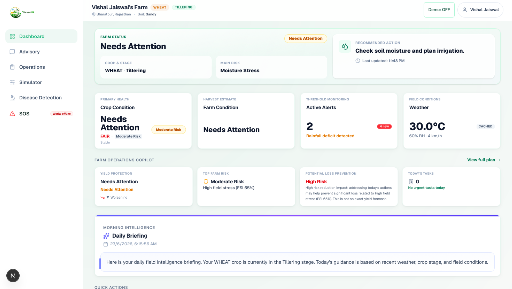

---

## Project Philosophy

We built HarvestIQ to solve a major problem with AI applications in critical fields like agriculture: the lack of reliability and trust. When dealing with chemical dosages, irrigation volumes, or outbreak responses, hallucinated advice from black-box LLMs can destroy a crop season and threaten a farmer's livelihood.

Our design separates core agricultural intelligence from the communication interface. The calculations—including growth stages, weather stress, soil quality, and yield risk assessments—are computed by structured Python algorithms. Large Language Models (Gemini via OpenRouter) are restricted to formatting the results, translating warnings, transcribing speech, or extracting visual features from crop images. By grounding the LLM prompt templates with retrieved scientific research from government and ICAR guidelines, we ensure that every advisory is fully transparent, explainable, and verified by real telemetry data.

---

## Core Engines & Mathematical Models

At the core of HarvestIQ is a deterministic engine that computes field indicators in [deterministic_engine.py](file:///Users/vishaljaiswal/Desktop/HARVESTIQ%20FINAL/harvestiq-engine/app/services/deterministic_engine.py).

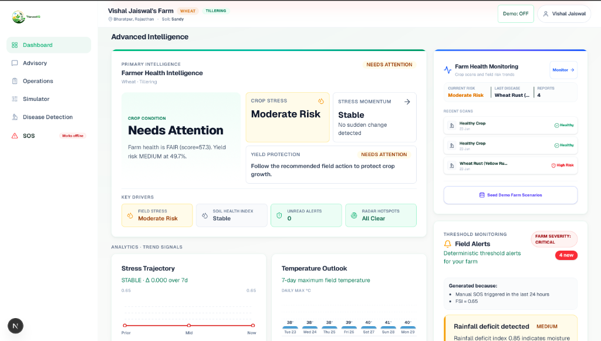

### 1. Crop Stage Engine (GDD)
Rather than tracking a crop's age by counting calendar days, we track developmental progress using thermal heat accumulation since the sowing date. This is much more accurate for real-world farming.

**Daily GDD Formula:**
$$\text{Daily GDD} = \max\left(\frac{T_{\text{max}} + T_{\text{min}}}{2} - T_{\text{base}}, 0.0\right)$$
*   $T_{\text{max}}$: Daily maximum forecast temperature.
*   $T_{\text{min}}$: Daily minimum forecast temperature.
*   $T_{\text{base}}$: Crop physiological base threshold (e.g., 10°C for Wheat).

**Accumulated GDD:**
$$\text{Accumulated GDD} = \sum_{t=\text{sowing-date}}^{\text{today}} \text{Daily GDD}_t$$
*   $t$: Daily time step from sowing date to today.
*   *Note: We map this accumulated sum against stage definitions to identify the crop's current stage (e.g., Tillering, Flowering, Heading).*

### 2. Field Stress Index (FSI) Engine
FSI combines multiple weather and development parameters into a single index from `0.0` (Optimal) to `1.0` (Severe Stress).

**Composite Scoring Formula:**
$$\text{FSI} = 0.40 \times S_{\text{temp}} + 0.35 \times S_{\text{rain-deficit}} + 0.25 \times S_{\text{gdd-scale}}$$
*   $S_{\text{temp}}$: Thermal stress index, calculated as $\text{clamp}\left(\frac{T_{\text{effective}} - T_{\text{opt}}}{T_{\text{crit}} - T_{\text{opt}}}\right)$, where $T_{\text{effective}}$ is the higher of current temperature and the 3-day forecast.
*   $S_{\text{rain-deficit}}$: Rainfall deficit index, calculated as $\text{clamp}\left(1.0 - \frac{\sum_{t=1}^{3} P_t}{E_{\text{expected}} \times 3}\right)$ based on 3-day rain projections.
*   $S_{\text{gdd-scale}}$: Growth vulnerability index, calculated as $\text{clamp}\left(\text{stage-vulnerability} \times \frac{\text{current-gdd}}{\text{stage-gdd-max}}\right)$.

---

### Secondary Models
Other engines—including the Stress Momentum Engine, Soil Health Index (SHI) Engine, Yield Risk Engine, and Unified Farm Health Score—are detailed in [docs/ALGORITHMS.md](file:///Users/vishaljaiswal/Desktop/HARVESTIQ%20FINAL/docs/ALGORITHMS.md).

---

## System Architecture & Data Flow

Here is a complete breakdown of the project architecture, showing how the frontend, backend service routers, local and cloud databases, and external APIs communicate with each other:

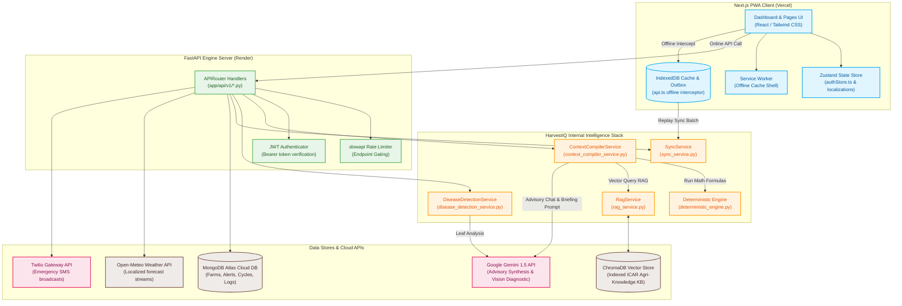

---

## Repository Structure

```text
HarvestIQ
├── harvestiq-client/                       # Next.js 15 PWA Frontend
│   ├── src/
│   │   ├── app/                            # App Router (advisory, auth, disease, simulator, operations)
│   │   ├── components/                     # Core Widgets (AdvisoryChat, CropStageProgress, FarmerHealthCard, SosButton)
│   │   ├── hooks/                          # Custom SWR & State hooks (useHealthCard, useWeather, useAlerts)
│   │   ├── lib/                            # API client, IndexedDB operations, outbox triggers
│   │   ├── stores/                         # Zustand state managers (authStore, localizationStore)
│   │   └── locales/                        # Localization dictionaries (en/hi)
│   ├── public/                             # PWA Manifest, icons, branding
│   ├── scripts/                            # Dev environment start script
│   └── README.md                           # Detailed Frontend Documentation
│
├── harvestiq-engine/                       # FastAPI & Python 3.12 Backend
│   ├── app/
│   │   ├── api/v1/                         # API router routes (auth, weather, advisory, simulator, sos, sync)
│   │   ├── core/                           # Database, security config, and deterministic constants (fsi, yield_risk, soil)
│   │   ├── models/                         # Pydantic Schemas & MongoDB documents
│   │   ├── services/                       # Core service layers (advisory_service, context_compiler_service, deterministic_engine)
│   │   └── integrations/                   # External APIs (gemini_client, Twilio)
│   ├── data/agri_kb/                       # ICAR & Government regional crop knowledge markdown files
│   ├── scripts/                            # Seed scripts, backfills, test scripts, and initialization workers
│   ├── tests/                              # Pytest test suite for service layers and APIs
│   └── README.md                           # Detailed Backend Documentation
│
├── docs/                                   # Platform documentation and screenshots
│   ├── screenshots/                        # Mapped dashboard, simulator, and alert screenshots
│   ├── ARCHITECTURE.md                     # System architecture and flow traces
│   └── INTELLIGENCE_LAYERS.md              # Master Intelligence Layer mapping
└── README.md                               # Root Master README
```

---

## Feature Showcase

### 1. Farm Operations Dashboard
The main control center maps the farm's GPS coordinates and crop sowing logs to produce live development data. It displays the current GDD stage, computed health band, and compiles daily meteorological warnings alongside an automated natural-language summary.

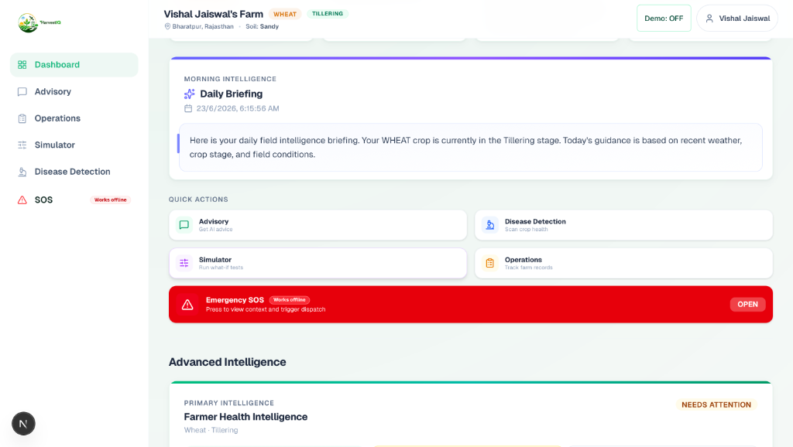

---

### 2. Threshold Monitoring & Alerts
An automated background evaluator scans incoming forecasts and computed stress trends against threshold boundaries. When parameters (like high temperature spikes or cold frost warnings) cross critical ranges, it triggers priority-tiered alerts on the dashboard to warn the user.

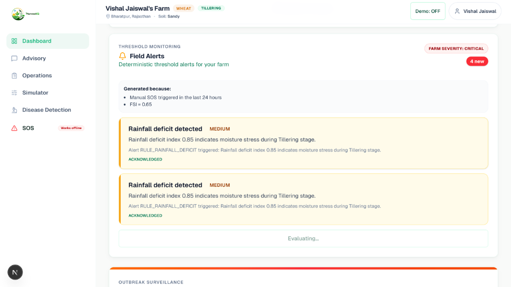

---

### 3. Advisory & Explainability Portal
A conversational portal built to help farmers get clear answers to agricultural questions. Unlike standard black-box AI tools, it query-retrieves research papers from ChromaDB and outputs the suggestions with a citation list and a table showing the raw telemetry values used in the reasoning.

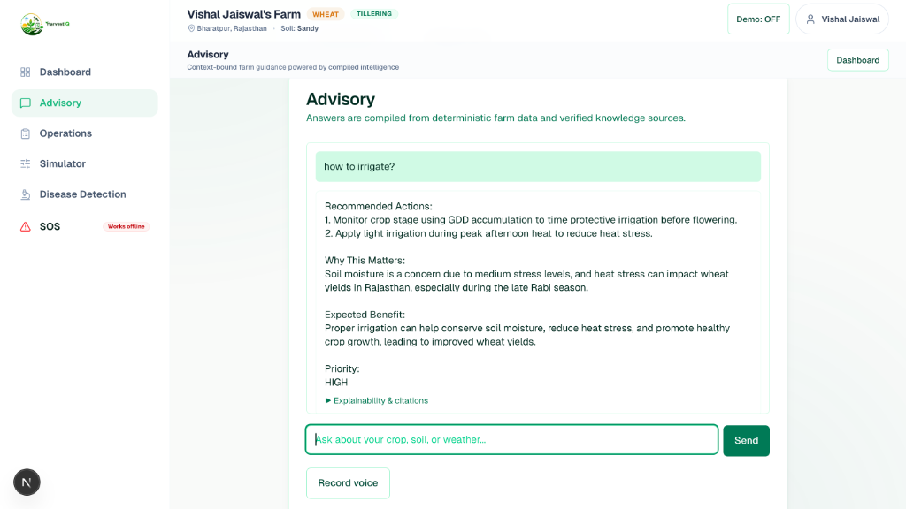
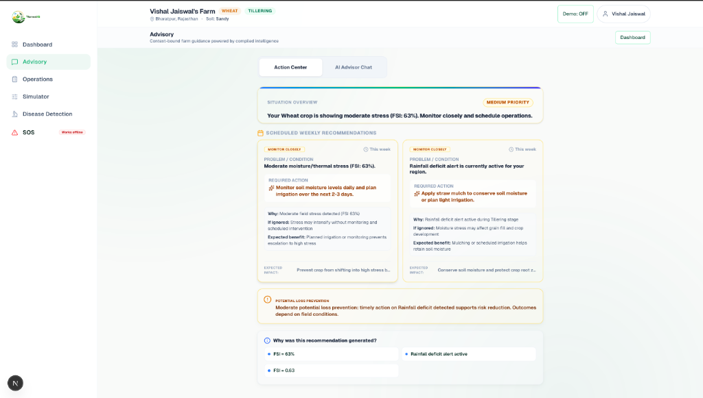

---

### 4. Farm Operations Ledger
A simple, local ledger that tracks crop expenses and income. Farmers can log inputs (seed, fertilizer, fuel, labor, or rental costs) for specific crop cycles to monitor operational costs and calculate profitability.

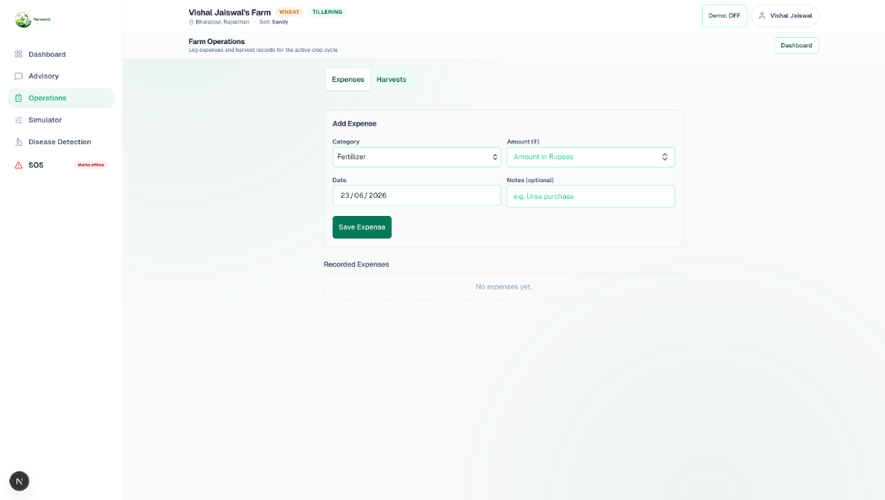

---

### 5. What-If Simulator
An interactive simulation engine allowing farmers to preview changes before taking action. It uses sliders to simulate changes in temperature forecasts, irrigation limits, or fertilizer inputs, plotting how these mock adjustments would impact stress and estimated yield factors.

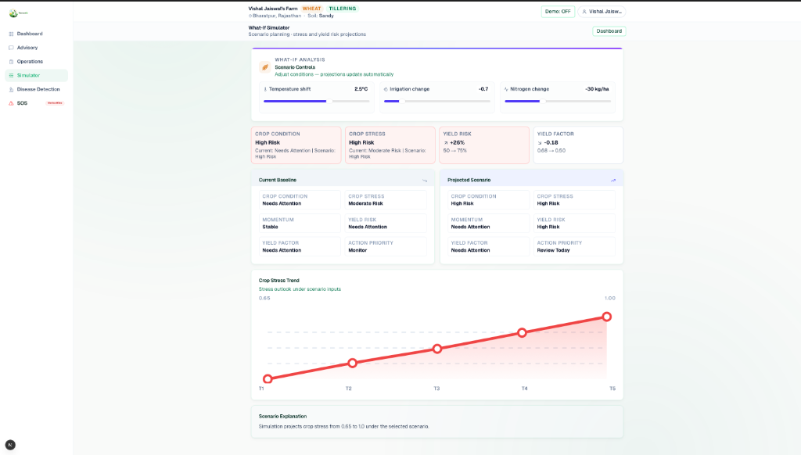

---

### 6. Crop Doctor (Disease Screening & Verification)
Uses leaf image diagnostic modules coupled with local verification checks. It includes a Pillow-based exposure check to flag dark or blurry images, an initial visual filter to confirm if a plant leaf is present, and a regional state allowlist to verify the diagnosis before saving reports.

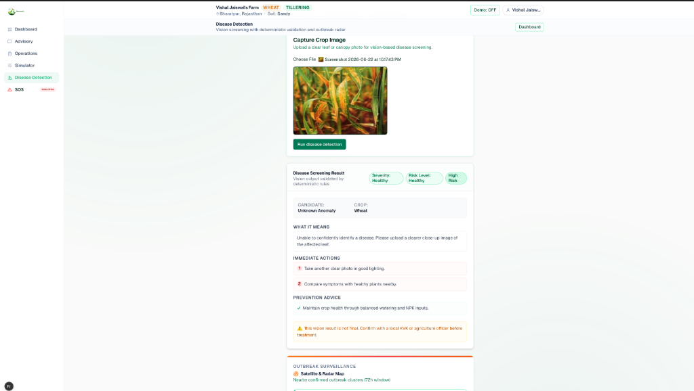

#### Image Quality & Validation Checks
*   **Exposure Check:** Grayscale mean and variance calculations prevent under/overexposed images from going to the API.
*   **Plant Presence Check:** A quick visual check blocks non-plant subjects (like objects or animals) to reduce false reports.

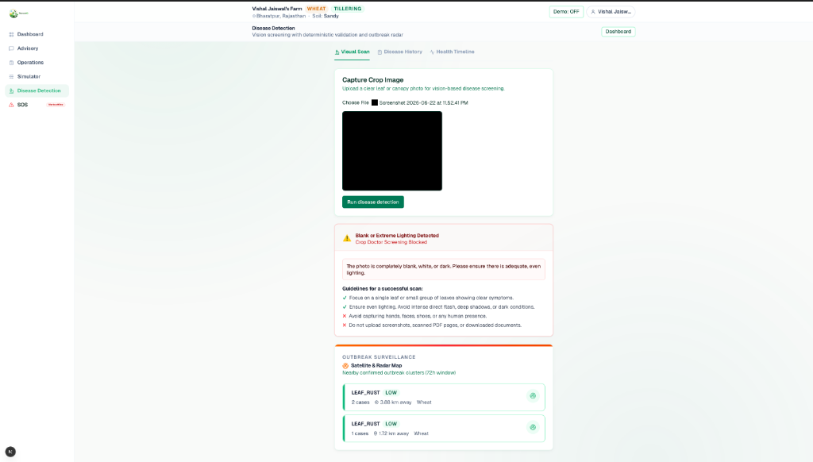
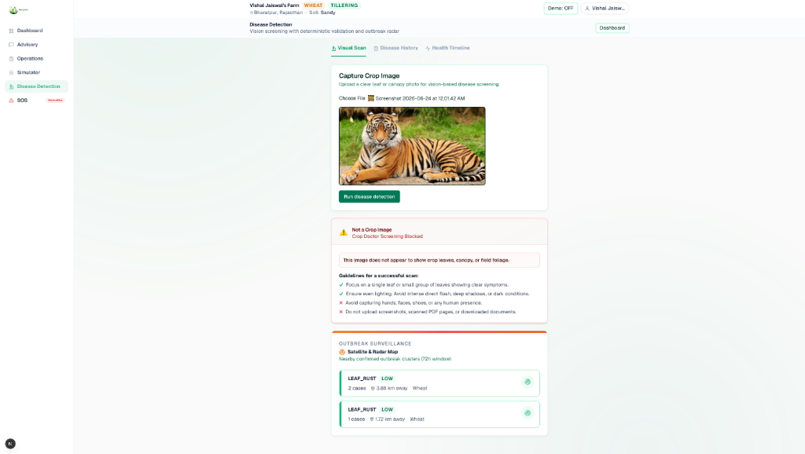

#### History & Timeline Logging
Tracks all scans and historical reports, consolidating alerts and diagnostic timelines into a chronological farm health log.

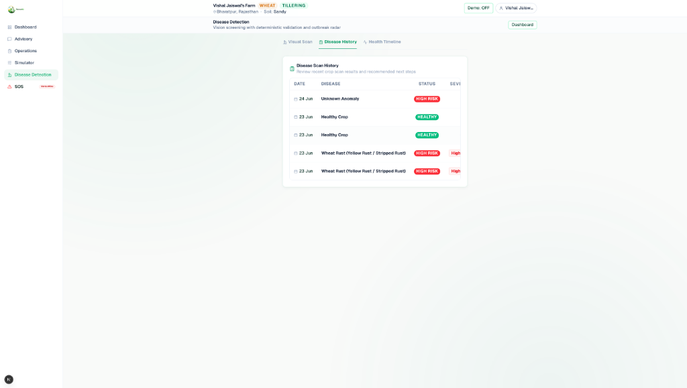
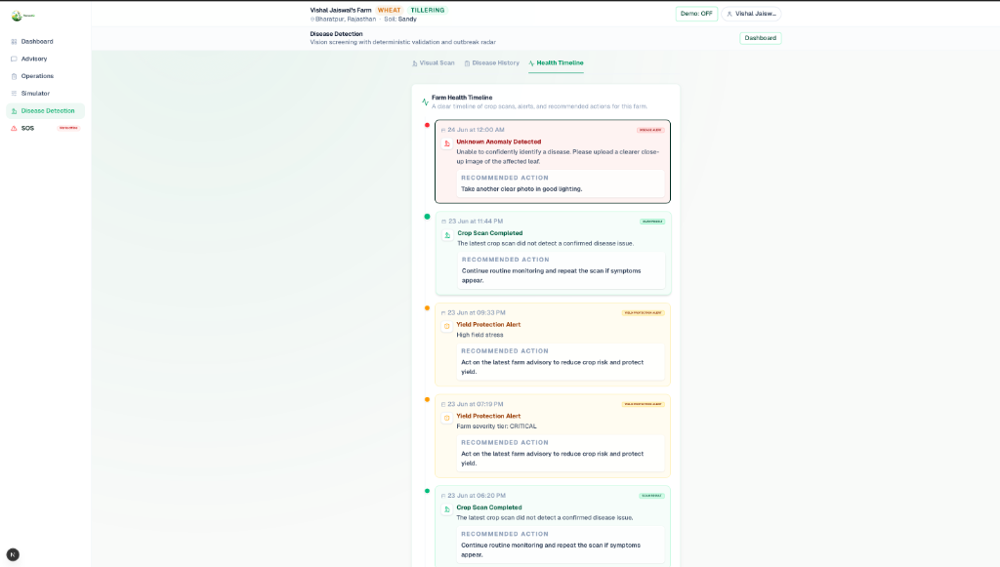

---

### 7. Emergency SOS Dispatch
Sends coordinates and urgent safety status alerts to a pre-set list of contacts during extreme weather events. If the phone is offline, the message is queued inside the outbox database and broadcasted using Twilio as soon as connectivity returns.

> [!NOTE]
> **Twilio Testing Limit:** Due to Twilio sandbox account constraints, emergency SOS alerts can only be delivered to phone numbers that are verified in our Twilio developer console. This is a prototype limitation and can be swapped for a production SMS gateway.

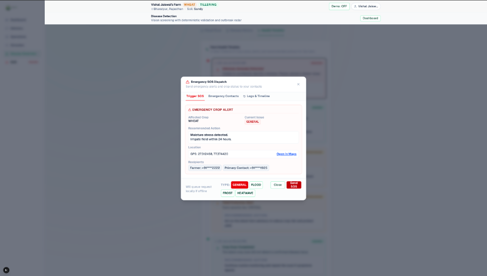
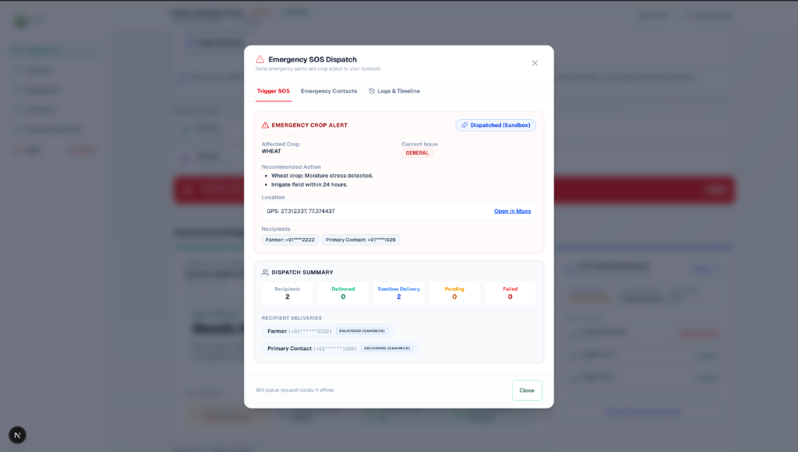

---

## Implementation Snippet

Below is the core function from our deterministic engine used to calculate the composite Field Stress Index (FSI). This calculation runs entirely in Python, avoiding LLM hallucinations:

```python
def compute_fsi(temp_stress: float, rainfall_deficit: float, gdd_scale: float) -> float:
    w_temp, w_rain, w_gdd = FSI_WEIGHTS # Loaded from constants: 0.40, 0.35, 0.25
    fsi = (w_temp * temp_stress) + (w_rain * rainfall_deficit) + (w_gdd * gdd_scale)
    return round(min(max(fsi, 0.0), 1.0), 2)
```

---

## Design Decisions

*   **FastAPI Backend:** We selected FastAPI because of its native ASGI concurrency and fast Pydantic schema validation. This allows us to compile multi-source forecast telemetry and index calculations efficiently.
*   **MongoDB Atlas:** We needed a flexible document model to handle changing farm bounds, variable crop cycles, and cache weather logs without the overhead of relational migrations.
*   **ChromaDB Vector Store:** Used locally for similarity search. It is lightweight, runs within our backend container, and matches keyword tokens alongside metadata tags.
*   **Separating Rules from AI:** We chose to keep calculations deterministic (written in Python) because letting an LLM calculate index numbers or dosages introduced severe hallucination risks. The LLM serves only to translate and present compiled data.
*   **Offline-First App Shell:** Built as a Progressive Web App (PWA) with service workers and IndexedDB because smallholder farms are often in spots with poor cell coverage. Optimistic updates keep the UI functional while transactions queue local changes until network sync is possible.

---

## Engineering Journey

We originally designed the advisory portal to compile raw prompt details and let the LLM directly output index ratings. However, early tests showed that prompt engineering alone could not prevent hallucinations in mathematical operations or crop-stage logic. 

We pivoted to a decoupled model: we wrote structured Python algorithms to calculate indexes (GDD, FSI, Soil Health) first, then passed this calculated state directly to the Gemini API prompt template. This transition made the system explainable, providing the exact formulas, inputs, and ICAR RAG citations alongside the LLM's natural-language summary.

---

## Lessons Learned

*   **Deterministic Gating:** High-stakes applications require deterministic boundaries. Mixing AI with rules is best done by using code for calculations and AI only for rendering responses.
*   **Reconciliation Challenges:** Offline-first syncing is complex when handling relationships. Generating temporary client-side IDs and mapping them to server-generated MongoDB `ObjectId` keys requires careful reconciliation of outbox queues.
*   **Telemetry Caching:** Frequent polling of forecast APIs quickly hits rate limits. Designing a localized cache layer using MongoDB TTL indices was essential to keep operations fast and cheap.

---

## Challenges

*   **Offline Synchronization:** Building the outbox queue to handle sequential operations (e.g., creating a plot, adding a cycle, and logging an expense) required strict ordering. If the operations sync out of order, foreign key references break.
*   **ChromaDB Metadata Gating:** Restricting vector search queries based on active crop variables and geographical boundaries required writing complex filtering checks before passing inputs to ChromaDB.

---

## API Reference

We maintain an exhaustive reference of the FastAPI backend router endpoints, including HTTP methods, slowapi decorators rate limits, and schemas in [docs/API_REFERENCE.md](file:///Users/vishaljaiswal/Desktop/HARVESTIQ%20FINAL/docs/API_REFERENCE.md). You can also interactively execute and test these endpoints at `https://harvestiq-api.onrender.com/docs` when the API engine is active.

---

## Security & Reliability

1.  **Token Authentication:** Secure routes are protected by JWT Bearer tokens.
2.  **Rate Limiting:** slowapi limits the amount of requests users can make to heavier APIs like SOS alerts and Gemini chat.
3.  **Geographical Allowlist:** The disease scanner checks if the detected crop disease actually exists in the farm's region before finalizing the diagnostic report.

---

## Validation & Test Suite

We wrote test suites to check our stress algorithms and API endpoints:

*   **Backend Tests (Pytest):**
    ```bash
    cd harvestiq-engine
    .venv/bin/pytest
    ```
*   **Offline Trace (PWA client):**
    ```bash
    cd harvestiq-client
    npm run trace:offline
    ```

---

## Scalability Strategy

*   **Stateless Backend Router:** Backend instances are stateless, making them easy to scale horizontally.
*   **MongoDB Partitioning:** MongoDB collections can easily be partitioned based on geographic coordinates.
*   **API Cache Layer:** We cache weather forecasts and local crop prices to prevent hitting rate limits on external APIs.

---

## Setup & Installation

### 1. Prerequisites
*   Node.js 20+
*   Python 3.12+
*   MongoDB Instance

### 2. Backend Installation
```bash
cd harvestiq-engine
./scripts/setup.sh
```
Configure your environment variables in `harvestiq-engine/.env`:
```env
MONGODB_URI=your_mongodb_connection_string
MONGODB_DB_NAME=HarvestIQ
JWT_SECRET_KEY=generate_a_secure_jwt_secret
OPENROUTER_API_KEY=your_openrouter_api_key_for_gemini
ENVIRONMENT=development
```
Seed database files:
```bash
.venv/bin/python scripts/seed_crop_characteristics.py
.venv/bin/python scripts/seed_localization.py
.venv/bin/python scripts/seed_knowledge_base.py
```
Start the service:
```bash
./scripts/start.sh
```

### 3. Frontend Installation
```bash
cd harvestiq-client
npm install
```
Configure local variables in `harvestiq-client/.env.local`:
```env
NEXT_PUBLIC_BACKEND_URL=http://127.0.0.1:8000
```
Start dev client:
```bash
npm run dev
```

---

## Future Roadmap

Here are the next features we plan to implement:
*   **Local Browser AI:** Running lightweight LLMs in the browser to provide advisory chat when completely offline.
*   **Multilingual Voice Search:** Adding voice-to-text input supporting regional Indian languages.
*   **WhatsApp Integration:** Forwarding SOS alerts directly to WhatsApp.
*   **NDVI Satellite Imagery:** Pulling satellite imagery to automatically track crop health indices and stress maps.

---

Made with ❤️