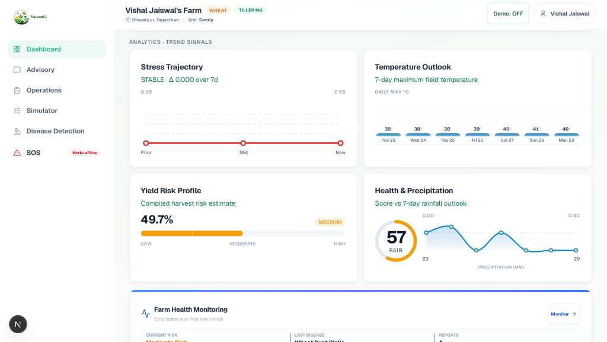
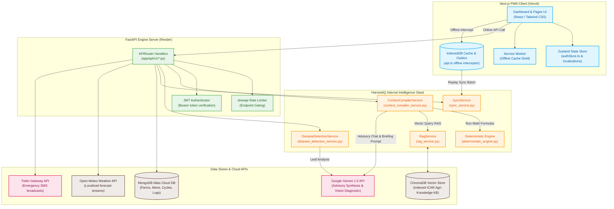

<details>
  <summary><b>Important Notes</b></summary>

  ### SOS Emergency Feature
  The SOS module is integrated with Twilio for SMS/call notifications.

  **Current Limitation:** Due to Twilio trial account restrictions, SOS alerts can currently be delivered only to phone numbers that have been verified in the Twilio console. Unverified numbers will not receive SMS/call notifications.

  For hackathon evaluation purposes, the feature is fully implemented and functional, but successful message delivery is limited to Twilio-verified recipient numbers.
</details>

<div align="center">

# HarvestIQ — Explainable Agricultural Intelligence Platform

### Smarter Agricultural Decision-Making via Deterministic Field Intelligence, Hybrid RAG, and Grounded Advisory Synthesis

[](https://nextjs.org/)
[](https://fastapi.tiangolo.com/)
[](https://www.mongodb.com/)
[](https://www.trychroma.com/)
[](https://deepmind.google/technologies/gemini/)
[](https://developer.mozilla.org/en-US/docs/Web/Progressive_web_apps)
[](https://vercel.com/)

</div>


## Quick Highlights

*   **Explainable Agricultural Intelligence Platform:** Hybrid design using deterministic calculations with Generative AI presentation.
*   **Deterministic Field Stress Index Engine:** Computes real-time thermal stress, rainfall deficits, and growth stage metrics.
*   **Crop Stage Intelligence using GDD:** Tracks developmental crop progress via Growing Degree Days heat accumulation.
*   **Disease Detection & Validation:** Visual analysis featuring Pillow image checks and state regional allowlists.
*   **Emergency SOS Alert System:** Twilio SMS broadcast alerts with location mapping coordinates and offline outbox queues.
*   **What-If Crop Simulation:** Evaluates projected stress curves and yield factor changes under hypothetical shifts.
*   **Offline-First Progressive Web App:** Shell service worker caching and IndexedDB queue sync replaying.
*   **FastAPI + Next.js + MongoDB Atlas:** Responsive PWA client, high-concurrency stateless backend APIs, slowapi rate limits, and secure store.

---

## Live Demo

*   **Frontend Dashboard (Next.js & Vercel PWA):** [https://harvest-iq-three.vercel.app](https://harvest-iq-three.vercel.app)
*   **Backend Engine (FastAPI & Render):** [https://harvestiq-api.onrender.com](https://harvestiq-api.onrender.com)
*   **API Interactive Documentation:** [https://harvestiq-api.onrender.com/docs](https://harvestiq-api.onrender.com/docs)

---

## Platform Dashboard


---

## Project Philosophy: Why HarvestIQ Is Different

**HarvestIQ is NOT an AI chatbot.** Traditional chatbots hallucinate instructions, lack physical grounding, and present severe liability risks when providing crop chemical dosages. 

HarvestIQ's architecture operates on a strict separation of concerns:
1.  **Deterministic Agricultural Intelligence:** 100% of the agronomic telemetry analysis, Growing Degree Days (GDD) growth tracking, Field Stress Index (FSI) calculations, laboratory Soil Health checks, and Outbreak Radar scans are executed by deterministic Python algorithms.
2.  **AI as a Presentation Layer:** Large Language Models (LLMs) are restricted strictly to visual feature extraction (for disease spot identification), native language translation (English, Hindi, and Marathi), and synthesizing structured intelligence payloads into conversational advisory briefings.
3.  **Explainability & Grounding:** Advisory responses are generated by compiling the current farm telemetry snapshot and querying indexed agronomic research repositories (government and ICAR standards) using hybrid metadata vector retrieval (RAG). Every advice is accompanied by a transparent audit trail showing exactly which deterministic indicators and document citations triggered the action.

---

## Project Journey (CodeFusion 2026)

HarvestIQ was built for **CodeFusion 2026** to address two critical engineering challenges in digital agriculture:

*   **The Hallucination Barrier:** In high-stakes environments like agriculture, a miscalculated chemical treatment or missed watering window can wipe out an entire season's yield. By embedding a deterministic gating validation pipeline, HarvestIQ eliminates black-box AI guidance.
*   **The Zero-Connectivity Constraint:** Smallholder farms in remote rural zones frequently operate under complete network dropouts. HarvestIQ solves this by building an offline-first app shell cached via Progressive Web App (PWA) service workers, storing local mutations inside IndexedDB collections, and utilizing a transactional outbox queue that automatically syncs and reconciles entity IDs with the MongoDB cloud once connection is restored.

---

## Executive Summary

### The Agricultural Problem
Modern farmers face compounding operational challenges. Weather volatility, nutrient deficiency, and sudden crop disease require immediate mitigation, yet traditional tools fall short:
*   **Static Agricultural Apps:** Rely on static databases, generic weather apps, and rigid lookup tables that fail to adapt to localized crop stages.
*   **Black-Box AI Models:** Hallucinate unverified treatments and lack the explainability required to make agronomic recommendations trustworthy.

### How HarvestIQ Solves It
HarvestIQ integrates localized weather predictions, laboratory soil nutrient metrics, crop-specific GDD progress, and regional disease radar reports into a single explainable interface. By keeping reasoning deterministic and presentation localized, it gives farmers transparent, reliable, and actionable insights to protect their fields and maximize yields.

---

## The HarvestIQ Intelligence Stack

At the center of HarvestIQ is a suite of decoupled services that compile telemetry and compute indices via [deterministic_engine.py](file:///Users/vishaljaiswal/Desktop/HARVESTIQ%20FINAL/harvestiq-engine/app/services/deterministic_engine.py).


---

### 1. Crop Stage Intelligence Engine (GDD)
Instead of tracking progress chronologically, HarvestIQ evaluates growth progress by thermal heat accumulation since sowing.
*   **Daily GDD Formula:**
    $$\text{Daily GDD} = \max\left(\frac{T_{\text{max}} + T_{\text{min}}}{2} - T_{\text{base}}, 0.0\right)$$
    *Where T-max and T-min represent daily weather forecast extremes, and T-base is the crop's physiological base threshold (e.g., 10°C for Wheat).*
*   **Accumulated GDD:**
    $$\text{Accumulated GDD} = \sum_{t=\text{sowing-date}}^{\text{today}} \text{Daily GDD}_t$$
    *Evaluated against bounds loaded via CropStageService to determine the crop's current stage (e.g., Tillering, Flowering, Heading).*

### 2. Field Stress Index (FSI) Engine
FSI compiles multiple stress parameters into a composite rating scale between `0.0` (Optimal) and `1.0` (Severe Stress).
*   **Composite Scoring Formula:**
    $$\text{FSI} = 0.40 \times S_{\text{temp}} + 0.35 \times S_{\text{rain-deficit}} + 0.25 \times S_{\text{gdd-scale}}$$
*   **Thermal Stress ($S_{\text{temp}}$):**
    $$S_{\text{temp}} = \text{clamp}\left(\frac{T_{\text{effective}} - T_{\text{opt}}}{T_{\text{crit}} - T_{\text{opt}}}\right)$$
    *Where T-effective is the maximum of current temperature and 3-day projected temperature forecast, T-opt is 32°C, and T-crit is 42°C.*
*   **Rainfall Deficit ($S_{\text{rain-deficit}}$):**
    $$S_{\text{rain-deficit}} = \text{clamp}\left(1.0 - \frac{\sum_{t=1}^{3} P_t}{E_{\text{expected}} \times 3}\right)$$
    *Where P-t represents the daily forecasted precipitation (mm), and E-expected is 5.0mm (daily water budget).*
*   **GDD Growth Scale ($S_{\text{gdd-scale}}$):**
    $$S_{\text{gdd-scale}} = \text{clamp}\left(\text{stage-vulnerability} \times \frac{\text{current-gdd}}{\text{stage-gdd-max}}\right)$$



---

### 3. Stress Momentum Engine
Monitors historical stress vectors to identify rapid deterioration before physical symptoms manifest.
*   **Momentum Formula:**
    $$\Delta = \text{FSI}_{\text{latest}} - \frac{\sum_{i=1}^{n-1} \text{FSI}_i}{n-1}$$
*   **Classification:**
    *   **RISING (Worsening):** $\Delta > 0.05$
    *   **FALLING (Recovering):** $\Delta < -0.05$
    *   **STABLE:** $-0.05 \le \Delta \le 0.05$

### 4. Soil Health Index (SHI) Engine
Analyzes laboratory measurements (Nitrogen, Phosphorus, Potassium, pH, Organic Carbon, Electrical Conductivity) against crop-specific optimal reference ranges.
*   **Formulation:**
    $$\text{SHI} = \frac{\sum (W_n \times S_n)}{\sum W_n}$$
    *Where W-n is the nutrient-specific weight (e.g., Nitrogen = 0.35, Phosphorus = 0.20, pH = 0.15) and S-n is the nutrient score mapped based on deviation bounds.*

### 5. Explainable Yield Risk Engine
Estimates compound yield risk by combining field indices, growth stage parameters, and nearby disease threats.
*   **Risk Evaluation:**
    $$\text{Risk Percentage} = \text{clamp}\left(0.30 \times \text{FSI} + 0.15 \times \text{Momentum} + 0.15 \times \text{Vulnerability} + 0.20 \times \text{Soil-Stress} + 0.20 \times \text{Disease-Presence}\right) \times 100$$
    *Yield risk classifications scale into bands: LOW (< 33%), MEDIUM (< 66%), and HIGH (>= 66%).*

### 6. Unified Farm Health Score
Synthesizes overall farm health into a rating out of 100:
$$\text{Health Score} = S_{\text{fsi}} \times 25 + S_{\text{soil}} \times 25 + S_{\text{radar}} \times 10 + S_{\text{alerts}} \times 10 + S_{\text{yield-risk}} \times 10$$
*   **Rating Bands:** `GOOD` ($\ge 75$), `FAIR` ($\ge 50$), and `POOR` ($< 50$).

---

## System Architecture & Data Flow

HarvestIQ is structured with decoupled application layers, dividing client-side service worker cache layers, stateless FastAPI handlers, and the deterministic agronomic intelligence stack:



---

## Feature Showcase

### 1. Farm Operations Dashboard
*   **Purpose:** Consolidated hub tracking core farm metrics.
*   **Inputs:** GPS coordinates, crop sowing configuration details.
*   **Outputs:** Overall health rating, computed GDD progress, crop stage, daily briefing text, and warning banners.
*   **Benefits:** Instant visibility of field operations and stress alerts.


---

### 2. Threshold Monitoring & Alerts
*   **Purpose:** Automatically trigger localized alerts when telemetry boundaries are crossed.
*   **Inputs:** Weather forecast parameters and calculated FSI metrics.
*   **Outputs:** Priority-tiered alerts (Info, Warning, Critical) indicating triggered rules.
*   **Benefits:** Proactive mitigation of environmental stress.


---

### 3. Advisory & Explainability Portal
*   **Purpose:** Conversational chat and action center providing recommendations.
*   **Inputs:** Question query, telemetry snapshot variables, RAG agronomic knowledge chunks.
*   **Outputs:** Synthesized advice accompanied by explainability tables and sources citations.
*   **Benefits:** Trustworthy advice grounded in verified agricultural research.


---

### 4. Farm Operations Ledger
*   **Purpose:** Record expenses and crop cycle transactions.
*   **Inputs:** Category (Seeds, Fertilizer, Labor, fuel, rent), amount, date, notes.
*   **Outputs:** Historical expenses log and financial cost lists.
*   **Benefits:** Complete tracking of farm profitability.


---

### 5. What-If Simulator
*   **Purpose:** Run simulations of weather and chemical adjustments before applying inputs.
*   **Inputs:** Sliders for Temperature Shifts ($\Delta^\circ\text{C}$), Irrigation Changes ($\Delta\text{mm}$), and Nitrogen variations ($\Delta\text{kg/ha}$).
*   **Outputs:** Projected FSI curve and simulated Yield Factor coefficients.
*   **Benefits:** Risk-free operational planning.


---

### 6. Crop Doctor (Disease Screening & Verification)
*   **Purpose:** Upload leaf photos to diagnose crop diseases.
*   **Inputs:** Camera or file image uploads.
*   **Outputs:** Candidate disease classification tags, severity levels, prevention advice, and regional rule confirmations.
*   **Benefits:** Eliminates false alarms through strict regional rule validation.


#### Image Quality & Validation Checks
The system includes validation to block blank, blurry, or non-crop image uploads:

*   **Blank or Extreme Lighting Check:** Pillow-based grayscale mean and variance analysis blocks overexposed or underexposed uploads.
*   **Not a Crop Image Check:** Vision-based content checks identify and block non-crop subjects (e.g. household items, animals).


#### History & Timeline Logging
All scan results are archived for historical tracking and auditing:

*   **Disease Scan History:** Track scan dates, identified diseases, confidence levels, and severity classifications.
*   **Farm Health Timeline:** A chronological events ledger tracking scans, alerts, and field advisories.


---

### 7. Emergency SOS Dispatch
*   **Purpose:** Dispatch SMS alerts to emergency contacts during extreme events.
*   **Inputs:** Event selection (Flood, Frost, Heatwave, General), GPS coordinates.
*   **Outputs:** SMS notifications containing maps links, sent via Twilio (or queued in outbox if offline).
*   **Benefits:** Ensures farmer safety and rapid coordination during crises.

> [!NOTE]
> **Twilio Sandbox Delivery Restriction:** Due to Twilio trial account restrictions, SOS alerts can currently be delivered only to phone numbers that have been verified in the Twilio console. Unverified numbers will not receive SMS/call notifications. For hackathon evaluation purposes, the feature is fully implemented and functional, but successful message delivery is limited to Twilio-verified recipient numbers.


---

## Technical Deep Dive

### Next.js 15 PWA Frontend
*   **PWA Shell caching:** Assets are cached locally via service workers to ensure immediate loading under offline conditions.
*   **Zustand:** Used for lightweight state management, handling credentials, offline caching, and outbox actions.
*   **React Query / SWR:** Manages network request state, triggers automatic background revalidation, and manages local IndexedDB fallbacks.
*   **Tailwind CSS:** Responsive, mobile-first design with smooth transitions and support for dark mode.

### FastAPI Python Backend
*   **Pydantic v2:** Enforces runtime request validation and response formatting.
*   **Slowapi:** Protects public endpoints with decorator rate limits (e.g., `@limiter.limit("20/15minutes")`).
*   **FastAPI APIRouter:** Modular architecture grouping routes into clean namespaces.
*   **Uvicorn:** ASGI server hosting the backend app on high-concurrency event loops.

### Storage & External APIs
*   **MongoDB Atlas:** Stores documents containing user profiles, farm records, offline sync logs, and weather caches.
*   **ChromaDB:** Local vector database storing indexed agronomic knowledge chunks (retrieved via cosine-similarity search for advisory prompts).
*   **Open-Meteo API:** Provides high-fidelity weather forecasts based on lat/lon coordinates.
*   **Twilio Client:** Integrates SMS broadcast workflows for emergency notifications.

---

## Repository Structure

```text
HarvestIQ
├── harvestiq-client/                       # Next.js 15 PWA Frontend
│   ├── src/
│   │   ├── app/                            # App Router (advisory, auth, disease, simulator, operations)
│   │   ├── components/                     # Core Widgets (AdvisoryChat, CropStageProgress, FarmerHealthCard, SosButton)
│   │   ├── hooks/                          # Custom SWR & State hooks (useHealthCard, useWeather, useAlerts)
│   │   ├── lib/                            # API client, IndexedDB operations, outbox triggers
│   │   ├── stores/                         # Zustand state managers (authStore, localizationStore)
│   │   └── locales/                        # Localization dictionaries (en/hi)
│   ├── public/                             # PWA Manifest, icons, branding
│   ├── scripts/                            # Dev environment start script
│   └── README.md                           # Detailed Frontend Documentation
│
├── harvestiq-engine/                       # FastAPI & Python 3.12 Backend
    ├── app/
    │   ├── api/v1/                         # API router routes (auth, weather, advisory, simulator, sos, sync)
    │   ├── core/                           # Database, security config, and deterministic constants (fsi, yield_risk, soil)
    │   ├── models/                         # Pydantic Schemas & MongoDB documents
    │   ├── services/                       # Core service layers (advisory_service, context_compiler_service, deterministic_engine)
    │   └── integrations/                   # External APIs (gemini_client, Twilio)
    ├── data/agri_kb/                       # ICAR & Government regional crop knowledge markdown files
    ├── scripts/                            # Seed scripts, backfills, test scripts, and initialization workers
    ├── tests/                              # Pytest test suite for service layers and APIs
    └── README.md                           # Detailed Backend Documentation
│
├── docs/                                   # Platform documentation and screenshots
│   ├── screenshots/                        # Mapped dashboard, simulator, and alert screenshots
│   ├── ARCHITECTURE.md                     # System architecture and flow traces
│   └── INTELLIGENCE_LAYERS.md              # Master Intelligence Layer mapping
└── README.md                               # Root Master README
```

---

## API Endpoints Reference


<details>
<summary><b>Click to expand full API Reference Table</b></summary>

### Authentication

| Method | Endpoint | Description | Slowapi Limit |
| :--- | :--- | :--- | :--- |
| `POST` | `/api/v1/auth/register` | Register a new user profile. | `20/15minutes` |
| `POST` | `/api/v1/auth/login` | Authenticate and obtain tokens. | `20/15minutes` |
| `POST` | `/api/v1/auth/refresh` | Refresh access tokens (via httponly cookie). | `10/15minutes` |
| `POST` | `/api/v1/auth/logout` | Revoke session refresh tokens. | - |

### Users & Onboarding

| Method | Endpoint | Description | Auth Required |
| :--- | :--- | :--- | :--- |
| `GET` | `/api/v1/users/me` | Fetch public details of current user. | Yes |
| `PUT` | `/api/v1/users/profile` | Update profile settings (name, language). | Yes |
| `GET` | `/api/v1/users/alert-preferences` | Get alert preference configurations. | Yes |
| `PUT` | `/api/v1/users/alert-preferences` | Update alert preferences. | Yes |
| `POST` | `/api/v1/onboarding` | Complete onboarding configuration. | Yes |

### Farm Database Management (CRUD)

| Method | Endpoint | Description | Parameters |
| :--- | :--- | :--- | :--- |
| `GET` | `/api/v1/farms/me` | Retrieve the compiled profile for the active farm. | Yes |
| `POST` | `/api/v1/farm-db/farms` | Create a new farm boundary record. | `FarmCreateSchema` (Body) |
| `GET` | `/api/v1/farm-db/farms` | List all farms owned by the user. | Yes |
| `GET` | `/api/v1/farm-db/farms/{farm_id}` | Retrieve specific farm bounds. | `farm_id` (Path) |
| `PUT` | `/api/v1/farm-db/farms/{farm_id}` | Edit farm boundaries and metadata. | `farm_id` (Path) |
| `DELETE` | `/api/v1/farm-db/farms/{farm_id}` | Remove farm records. | `farm_id` (Path) |
| `GET` | `/api/v1/farm-db/plots` | List plots in a farm. | `farm_id` (Query) |
| `POST` | `/api/v1/farm-db/plots` | Create a new plot record. | `PlotCreateSchema` (Body) |
| `GET` | `/api/v1/farm-db/crop-cycles` | List crop cycles for a plot. | `plot_id` (Query) |
| `GET` | `/api/v1/farm-db/crop-cycles/active` | Get all active cycles of the user. | Yes |
| `POST` | `/api/v1/farm-db/expenses` | Log crop expense transactions. | `ExpenseCreateSchema` (Body) |
| `GET` | `/api/v1/farm-db/expenses` | List expenses for a cycle. | `crop_cycle_id` (Query) |
| `POST` | `/api/v1/farm-db/harvests` | Log harvest yield transactions. | `HarvestCreateSchema` (Body) |
| `GET` | `/api/v1/farm-db/harvests` | List harvests for a cycle. | `crop_cycle_id` (Query) |

### Weather, Stress & Soil Analytics

| Method | Endpoint | Description | Parameters |
| :--- | :--- | :--- | :--- |
| `GET` | `/api/v1/weather/forecast` | Retrieve forecast data with MongoDB TTL caching. | `farm_id` (Query) |
| `GET` | `/api/v1/stress-index/{farm_id}` | Fetch current Field Stress Index and trajectory. | `farm_id` (Path) |
| `POST` | `/api/v1/soil/records` | Save laboratory soil measurements. | `SoilRecordCreateSchema` (Body) |
| `GET` | `/api/v1/soil/records/latest` | Fetch the latest soil nutrient scores. | `farm_id` (Query) |

### Copilot & Advisory

| Method | Endpoint | Description | Parameters |
| :--- | :--- | :--- | :--- |
| `GET` | `/api/v1/briefing/daily` | Compile daily briefing summaries. | `farm_id` (Query) |
| `GET` | `/api/v1/health-card` | Get farm health metrics cards. | `farm_id` (Query) |
| `GET` | `/api/v1/copilot/plan` | Fetch or generate operations schedules. | `farm_id`, `refresh` (Query) |
| `POST` | `/api/v1/copilot/plan/refresh` | Force regenerate copilot plans. | `farm_id` (Query) |
| `PUT` | `/api/v1/copilot/plan/actions/{action_id}/complete` | Mark an action complete. | `action_id` (Path), `farm_id` (Query) |
| `GET` | `/api/v1/copilot/yield-protection` | Retrieve computed yield protection score. | `farm_id` (Query) |
| `POST` | `/api/v1/advisory/ask` | Submit questions to advisory chat. | `AdvisoryAskRequest` (Body) |
| `GET` | `/api/v1/advisory/actions` | Retrieve recommended actions list. | `farm_id` (Query) |

### Disease Detection & Outbreak Radar

| Method | Endpoint | Description | Parameters |
| :--- | :--- | :--- | :--- |
| `POST` | `/api/v1/disease/detect` | Upload leaf images for disease screening. | File upload (Multipart) |
| `GET` | `/api/v1/disease/history` | List all historical reports. | `farm_id` (Query) |
| `GET` | `/api/v1/disease/history/{report_id}` | Retrieve specific scan reports. | `report_id` (Path) |
| `GET` | `/api/v1/disease/history/{report_id}/image` | Fetch raw uploaded image bytes. | `report_id` (Path) |
| `GET` | `/api/v1/disease/timeline` | Get merged event timeline records. | `farm_id` (Query) |
| `GET` | `/api/v1/disease-radar/nearby` | Query nearby outbreak coordinates. | `farm_id` (Query) |

### Emergency SOS & Sync

| Method | Endpoint | Description | Parameters |
| :--- | :--- | :--- | :--- |
| `POST` | `/api/v1/sos/trigger` | Dispatch emergency SOS alerts to contacts. | `SosTriggerRequest` (Body) |
| `POST` | `/api/v1/sos/dispatch` | Trigger emergency dispatch (alias trigger). | `SosTriggerRequest` (Body) |
| `GET` | `/api/v1/sos/contacts` | Get user emergency contacts list. | Yes |
| `POST` | `/api/v1/sos/contacts` | Save emergency contact configurations. | `EmergencyContactsSchema` (Body) |
| `GET` | `/api/v1/sos/history` | Fetch historical SOS logs. | Yes |
| `POST` | `/api/v1/simulator/run` | Run stress forecast simulation runs. | `SimulatorRequest` (Body) |
| `POST` | `/api/v1/sync` | Replay batch IndexedDB outbox queues. | `SyncBatchRequest` (Body) |

</details>

---

## Security & Reliability

1.  **Bearer Gating:** All operations (excluding register, login, and static assets) require valid HTTP Bearer token validation.
2.  **Rate Limiting:** slowapi rates restrict excessive queries to advisory ask and SOS triggers.
3.  **Regional Restriction Rules:** Disease validation logic cross-references detected diseases with local agricultural lists, preventing misdiagnoses and false reports.

---

## Validation & Test Suite

To verify correct stress calculation formulas and system reliability:

*   **Backend Pytest Suite:**
    ```bash
    cd harvestiq-engine
    .venv/bin/pytest
    ```
*   **PWA Client Offline Verification Trace:**
    ```bash
    cd harvestiq-client
    npm run trace:offline
    ```

---

## Scalability Strategy

*   **Stateless Scaling:** Backend routes are stateless, making horizontal scaling easy.
*   **Database Partitioning:** MongoDB collections can shard farm profiles by geographical grids.
*   **Caching:** In-memory caching on meteorological coordinates and Mandi price endpoints prevents downstream resource exhaustion.

---

## Why HarvestIQ Is Different

| Criteria | Generic AI Chatbot | Traditional Ag App | HarvestIQ Platform |
| :--- | :--- | :--- | :--- |
| **Logic Type** | Generative only (Hallucinations possible) | Static tables | **Deterministic calculations with explainable synthesis** |
| **Connectivity** | Fails completely offline | Limited static storage | **Offline-first PWA with sync queues** |
| **Decision Gating** | None | Simple rules | **Scientific calculations combined with regional allowlists** |
| **Precision** | High risk of hallucinated advice | Generic advice | **Explainable advisory grounded with citations** |

---

## Setup & Installation

### 1. Prerequisites
*   Node.js 20+
*   Python 3.12+
*   MongoDB Instance

### 2. Backend Installation
```bash
cd harvestiq-engine
./scripts/setup.sh
```
Configure your environment variables in `harvestiq-engine/.env`:
```env
MONGODB_URI=your_mongodb_connection_string
MONGODB_DB_NAME=HarvestIQ
JWT_SECRET_KEY=generate_a_secure_jwt_secret
OPENROUTER_API_KEY=your_openrouter_api_key_for_gemini
ENVIRONMENT=development
```
Seed database files:
```bash
.venv/bin/python scripts/seed_crop_characteristics.py
.venv/bin/python scripts/seed_localization.py
.venv/bin/python scripts/seed_knowledge_base.py
```
Start the service:
```bash
./scripts/start.sh
```

### 3. Frontend Installation
```bash
cd harvestiq-client
npm install
```
Configure local variables in `harvestiq-client/.env.local`:
```env
NEXT_PUBLIC_BACKEND_URL=http://127.0.0.1:8000
```
Start dev client:
```bash
npm run dev
```

---

## Future Roadmap

*   **Offline Advisory:** Synthesize raw advisory briefings client-side during absolute network outages using lightweight browser LLM engines.
*   **Multilingual Voice Assistant:** Expand native vocal transcription modules for regional dialects.
*   **WhatsApp Integration:** SMS alerts forwarding to WhatsApp messaging accounts.
*   **NDVI Satellite Analytics:** Incorporate spatial spectral imaging updates for automated stress indexing.

---

Made with ❤️ by HarvestIQ Team