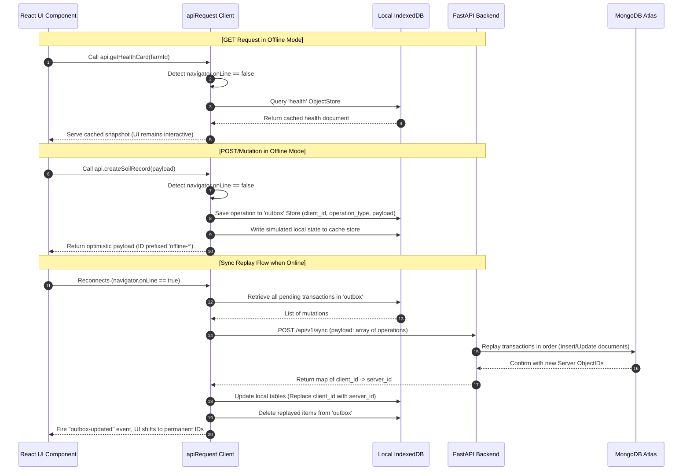
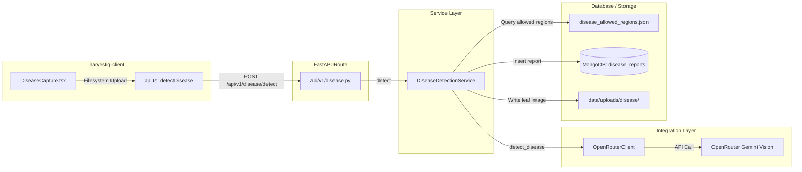
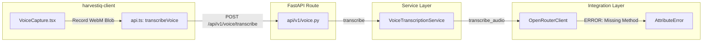
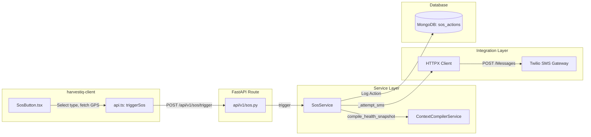
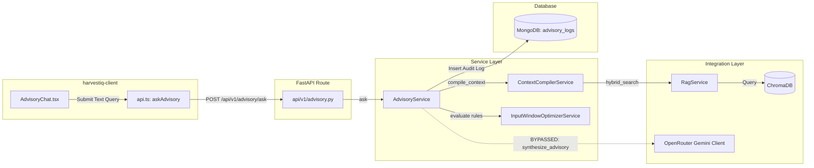

# System Architecture & Flow Traces

This document breaks down how we structured HarvestIQ, how its core components fit together, our hybrid intelligence strategy, and step-by-step traces showing how data flows through our services.

---

## Hybrid Intelligence Design Philosophy

We designed HarvestIQ with a clear rule: **never let the LLM make high-risk agronomic decisions**. That's why we use a hybrid design:
1.  **Deterministic Calculations (Python):** All calculations for soil, stress indices, yield risks, and emergency checklists are handled by normal Python code on the backend or client. Generative AI is never in charge of scoring farm safety.
2.  **Generative Presentation (Gemini):** We only use the LLM (Gemini via OpenRouter) to write readable summaries, translate languages, transcribe audio, or analyze leaf images (Crop Doctor leaf tagging).
3.  **Strict Grounding:** The LLM is strictly constrained. The backend compiles a structured snapshot (`ContextCompilerService` snapshot version **v3**) of the farm state and feeds it to Gemini as the *only* source of truth.

---

## Core Engines & Components

### 1. Authentication
*   **How it works:** Standard OAuth2 Password Bearer flow.
*   **Tokens:** Returns a JWT `access_token` (expires in 15 mins) and a hashed `refresh_token` (stored in MongoDB `sessions` with a 7-day TTL).
*   **State Management:** The frontend store (`authStore.ts` using Zustand) keeps the JWT in memory, and the refresh token is stored in a secure HTTP-only cookie.
*   **Offline Mode:** If we lose connection and can't refresh the token, the client switches to offline mode. It intercepts API calls and pulls data from local IndexedDB caches or static mocks so the UI doesn't break.

### 2. Weather Engine
*   **How it works:** `WeatherService` handles weather queries. It checks if we have cached weather data for the coordinates that is less than 30 minutes old. If it's stale, it hits the Open-Meteo API.
*   **Caching:** Saves forecast telemetry (hourly temps, rain, wind, humidity, 7-day forecast) to MongoDB (`weather_cache` collection) with a TTL index.
*   **GDD Math:** Computes daily Growing Degree Days: $\text{GDD} = \max\left(\frac{T_{\text{max}} + T_{\text{min}}}{2} - T_{\text{base}}, 0.0\right)$ where $T_{\text{base}}$ is fetched from `crop_characteristics` depending on the active crop.

### 3. Crop Stage Engine
*   **How it works:** `CropStageService` monitors active `crop_cycles`.
*   **Steps:**
    1. Pulls weather history and forecast coordinates.
    2. Adds up daily GDD starting from the sowing date.
    3. Maps accumulated GDD bounds to growth stages (like Tillering, Flowering, Maturity) stored in `crop_characteristics`.
    4. Updates the `crop_cycles` document in MongoDB with the GDD and calculates progress percentage.

### 4. Stress Index Engine (Field Stress Index - FSI)
*   **How it works:** `StressIndexService` calculates a composite score between `0.0` (optimal) and `1.0` (critical) using: $\text{FSI} = 0.40 \times S_{\text{temp}} + 0.35 \times S_{\text{rain-deficit}} + 0.25 \times S_{\text{gdd-scale}}$
    *   **$S_{\text{temp}}$ (Temperature Stress):** Evaluates the max temp in a 3-day forecast against optimal ($32^\circ\text{C}$) and critical ($42^\circ\text{C}$) limits.
    *   **$S_{\text{rain-deficit}}$ (Rain Deficit):** Compares 3-day rain projections with the crop's daily water requirement (budgeted at $5\text{mm}$ daily).
    *   **$S_{\text{gdd-scale}}$ (Growth Vulnerability):** Weighting based on current GDD growth stage.
*   **Stress Momentum:** Checks if stress is getting worse or recovering by comparing the current FSI against the average of the last 5 logs: $\Delta = \text{FSI}_{\text{latest}} - \text{Avg}(\text{FSI}_{\text{historical}})$ (categorized as `RISING` if $\Delta > 0.05$, `FALLING` if $\Delta < -0.05$, or `STABLE` otherwise).

### 5. Soil Health Engine
*   **How it works:** `SoilHealthService` evaluates nutrient metrics (Nitrogen, Phosphorus, Potassium, pH, Organic Carbon, Electrical Conductivity).
*   **Steps:**
    1. Checks raw values against reference guidelines in `soil_reference_ranges.json`.
    2. Flags each nutrient as `DEFICIENT`, `OPTIMAL`, or `HIGH`.
    3. Calculates a weighted composite Soil Health Index (SHI) score out of 100.
    4. Generates an explainable summary via `explainability_service.py`.

### 6. RAG Retrieval Engine
*   **How it works:** `RagService` performs hybrid vector + keyword matching.
*   **Steps:**
    1. Extracts query topics, crop, state, and district.
    2. Looks up MongoDB `knowledge_metadata` to find allowed document IDs.
    3. Queries ChromaDB, filtering by geographic metadata and allowed IDs.
    4. Combines cosine similarity (80% weight) with keyword token frequency (20% weight) to return the most relevant text chunks.

### 7. Yield Risk Engine
*   **How it works:** `YieldRiskService` combines multiple telemetry indicators to assess potential yield danger.
*   **Inputs:** FSI, Stress Momentum, growth stage, soil index, confirmed crop diseases, and regional radar warnings.
*   **Outputs:** Maps risk into bands: `LOW` (<35%), `MEDIUM` (35–70%), or `HIGH` (>70%).

### 8. Unified Farm Health Score
*   **How it works:** Summarizes all signals into a single score out of 100: $\text{Health Score} = S_{\text{fsi}} \times 25 + S_{\text{soil}} \times 25 + S_{\text{radar}} \times 10 + S_{\text{alerts}} \times 10 + S_{\text{yield-risk}} \times 10$ (classified as `GOOD` $\ge 75$, `FAIR` $50\text{--}74$, or `POOR` $<50$).

---

## Offline-First Architecture & Sync Engine

Since cell service is notoriously unreliable in rural fields, we built a custom offline sync engine into `harvestiq-client`. Here is the sequence:

### How We Reconcile IDs (Relationship Reconciliation)
When a farmer creates a Farm, Plot, or Crop Cycle offline, the client generates temporary IDs (like `plot-1718000-xyz`) and saves them in the outbox. When the phone goes back online, the frontend sends the outbox queue to the backend. The backend inserts the records into MongoDB, which generates permanent `ObjectId` keys.
Our frontend `syncOutbox` service receives this ID mapping map (`client_id` -> `server_id`) and updates local IndexedDB keys, so subsequent syncs or references don't result in duplicate entries.

---

## End-to-End Flow Traces

Here we map the execution flow from the Frontend to the API, Service, Integration, and Database layers for the four requested features.

### Flow 1: Disease Detection (Crop Doctor)

1.  **Frontend Interaction:** The user chooses a leaf photo in `DiseaseCapture.tsx` and clicks "Run disease detection".
2.  **API Handler:** `api.detectDisease(farmId, file)` compiles a `FormData` object containing the image file and `farm_id`. It POSTs this payload to `/api/v1/disease/detect`.
3.  **FastAPI Endpoint:** `/api/v1/disease/detect` parses the files, verifies authentication, and initializes `DiseaseDetectionService`.
4.  **Service Processing:**
    *   Resolves the farm's state, district, and active crop cycle crop type (e.g., `WHEAT`).
    *   Passes image bytes and details to `OpenRouterClient.detect_disease()`.
5.  **Integration Layer:** `OpenRouterClient` encodes the leaf image to base64, constructs a visual analysis prompt, and posts it to OpenRouter (`https://openrouter.ai/api/v1/chat/completions`) requesting visual tag and confidence.
6.  **Deterministic Confirmation (Backend Service):**
    *   Receives prediction (e.g. `YELLOW_RUST`, `92%`).
    *   Cross-references with state allowlist (`data/disease_allowed_regions.json`).
    *   Applies confidence rules: Detections $\ge 80\%$ are bypass-confirmed; otherwise they must match the allowed region or get demoted/rejected.
7.  **Database Persistence:**
    *   Writes report details and explanation logs to MongoDB `disease_reports`.
    *   Saves the raw image file to `data/uploads/disease/{report_id}.jpg` and records the path key. Returns `DiseaseDetectResponse`.

---

### Flow 2: Voice Advisory (Voice Transcription)

1.  **Frontend Interaction:** The farmer clicks "Record voice" inside `VoiceCapture.tsx` (nested in `AdvisoryChat.tsx`), records speech, and hits "Stop recording".
2.  **API Handler:** The recorded audio chunk is packed into a WebM Blob and forwarded to `api.transcribeVoice(blob, language)`. This POSTs a multipart payload to `/api/v1/voice/transcribe`.
3.  **FastAPI Endpoint:** `/api/v1/voice/transcribe` intercepts the upload, reads raw audio bytes, and initializes `VoiceTranscriptionService`.
4.  **Service Processing:**
    *   Checks that file sizes are within limits ($2\text{ MB}$ max) and checks file types (WebM, WAV, etc.).
    *   Attempts to call `self.gemini_client.transcribe_audio(audio_bytes, mime_type, language)`.
5.  **Why it fails (Integration Failure):**
    *   The backend code calls `self.gemini_client.transcribe_audio(...)` on the `OpenRouterClient`, but that method hasn't been implemented in the client class yet.
    *   This raises a Python `AttributeError`.
    *   The service layer catches it and returns a `502 Bad Gateway` error back to the frontend.
    *   **Result:** The flow breaks at the integration level, and no files or logs are saved in MongoDB.

---

### Flow 3: SOS Dispatch (Emergency Alarm)

1.  **Frontend Interaction:** The user presses the "SOS" widget button, selects an emergency type (e.g. `FLOOD`), and confirms dispatch.
2.  **Location Fetch:** The browser retrieves geographic GPS coordinates via the HTML5 Geolocation API.
3.  **API Handler:** Calls `api.triggerSos(payload)` with farm ID, emergency type, latitude, and longitude.
    *   *Offline Intercept:* If offline, `apiRequest` catches the state, queues a `TRIGGER_SOS` action inside IndexedDB `outbox` store, and immediately returns local emergency contact phone numbers.
    *   *Online Path:* Performs a POST request to `/api/v1/sos/trigger`.
4.  **FastAPI Endpoint:** `/api/v1/sos/trigger` extracts parameters and passes them to `SosService.trigger()`.
5.  **Service Processing:**
    *   Looks up the user and farm parameters in MongoDB.
    *   Calls `ContextCompilerService.compile_health_snapshot()` to retrieve the current clapped health score and yield risk band of the farm.
    *   Generates a checklist of immediate actions.
    *   Formulates a plain text warning message.
6.  **Integration Layer:**
    *   If `twilio_enabled` is true, calls `_attempt_sms()`.
    *   Sends an asynchronous HTTP POST request to Twilio API `/Accounts/{sid}/Messages.json` to transmit the alarm message to the farmer's registered phone.
7.  **Database Logging:** Inserts the SOS action log (including triggered time, delivery status, coordinates, and compiled checklist) into MongoDB `sos_actions` collection and returns `SosTriggerResponse`.

---

### Flow 4: Advisory (Context Grounded Farm Chat)

1.  **Frontend Interaction:** User types a query (e.g. "Should I irrigate my wheat today?") in `AdvisoryChat.tsx` and hits Send.
2.  **API Handler:** Invokes `api.askAdvisory(payload)`.
    *   *Offline Intercept:* If offline, runs `evaluateOfflineQuery(query)` locally in the browser (via hardcoded keywords matching in `offlineAi.ts`), enqueues `AUDIT_ADVISORY_QUERY` in IndexedDB outbox, and returns the response.
    *   *Online Path:* POSTs to `/api/v1/advisory/ask`.
3.  **FastAPI Endpoint:** `/api/v1/advisory/ask` maps the request to `AdvisoryService.ask()`.
4.  **Service Processing & Compiler:**
    *   Calls `ContextCompilerService.compile_context()` to build the farm state snapshot (GDD, FSI, Weather, alerts, and disease history).
    *   `ContextCompilerService` invokes `RagService.hybrid_search()` to scan ChromaDB and retrieve contextual knowledge chunks based on query keywords and farm parameters.
    *   `AdvisoryService` runs intent classification keywords matching (e.g. matches `IRRIGATION` from the keyword "irrigate").
    *   Evaluates guidelines (e.g. checks wind speeds or rainfall with `InputWindowOptimizerService`).
5.  **Rule Gating & Gemini Bypass:**
    *   *How it's currently coded:* Even though we set up `OpenRouterClient.synthesize_advisory` to send the context snapshot to Gemini, the backend implementation inside `AdvisoryService.ask()` currently bypasses the LLM and runs a local rules matrix with string interpolation.
    *   *Underlying Bug:* If we do try to call the Gemini API client, it fails because `synthesize_advisory` points to Google's direct Gemini endpoint but doesn't pass the authorization headers (the `headers` dict with API keys is set up in `detect_disease` but was left out in `synthesize_advisory`).
6.  **Database Persistence:** Writes details (query, context package hash, final synthesis output, RAG chunks, and rules) to MongoDB `advisory_logs`. Returns `AdvisoryAskResponse`.
