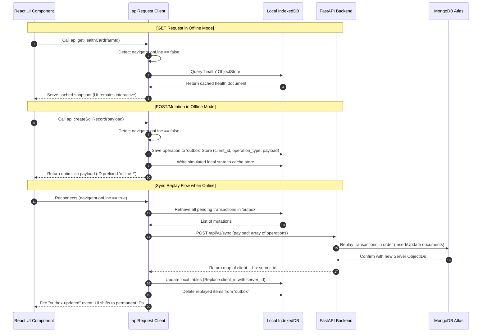
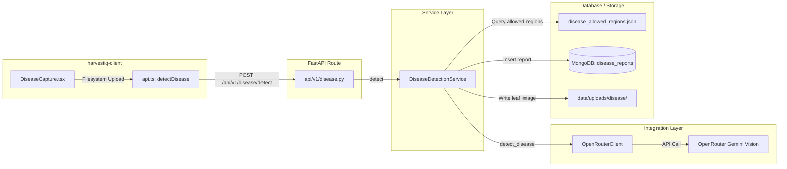
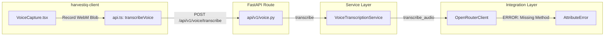
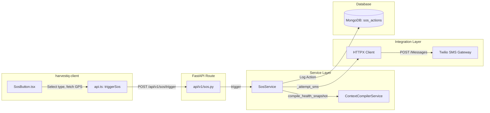
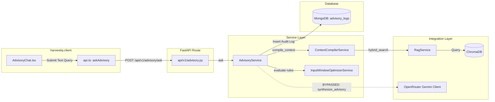

# System Architecture & Flow Traces

This document details the architectural design of HarvestIQ, its core components, its hybrid intelligence model, and end-to-end trace routes for key operational flows.

---

## Hybrid Intelligence Design Philosophy

HarvestIQ employs a strict **Hybrid Intelligence** paradigm:
1.  **Deterministic Calculations:** All agronomic math, threat modeling, yield risks, soil indexes, and emergency checklists are computed 100% deterministically by the Python backend or edge client. Generative AI is NEVER permitted to decide or score farm safety.
2.  **Generative Presentation:** Large Language Models (Gemini via OpenRouter) are used exclusively for natural language synthesis (translating raw metrics into localized reports for the farmer), voice transcription, and visual image classification (Crop Doctor leaf tagging). 
3.  **Strict Grounding:** The generative models are context-grounded. The deterministic backend compiles a structured snapshot (`ContextCompilerService` snapshot version **v3**) of the farm state and inputs it as the only valid knowledge source in the prompt template.

---

## Core Engines & Components

### 1. Authentication Subsystem
*   **Mechanisms:** Standard OAuth2 Password Bearer flow.
*   **Tokens:** Serves a JWT `access_token` (expires in 15 minutes) and a hashed `refresh_token` (stored in the MongoDB `sessions` collection with a 7-day TTL).
*   **State:** The client stores the JWT in memory and a stateful Zustand store (`authStore.ts`). The refresh token is sent as a secure, HTTP-only cookie.
*   **Offline Behavior:** When offline, if token refresh fails, the client transitions to offline mode. API requests are intercepted and redirected to IndexedDB caches or static fixtures to maintain UI availability.

### 2. Weather Engine
*   **Mechanism:** `WeatherService` coordinates fetching. If cached data for a farm is younger than 30 minutes, it returns the cache. Otherwise, it invokes the Open-Meteo REST API.
*   **Persistence:** The forecast data (hourly temperature, precipitation, wind speed, humidity, and 7-day forecasts) is cached in the MongoDB `weather_cache` collection with an `expires_at` TTL index.
*   **GDD Calculation:** Generates daily GDD indices:
    $$\text{GDD} = \max\left(\frac{T_{\text{max}} + T_{\text{min}}}{2} - T_{\text{base}}, 0.0\right)$$
    where $T_{\text{base}}$ is retrieved from `crop_characteristics` depending on the active crop.

### 3. Crop Stage Engine
*   **Mechanism:** `CropStageService` monitors active `crop_cycles`.
*   **Flow:**
    1. Fetches historical and forecast weather for the farm.
    2. Gathers daily GDD entries from the sowing date to today.
    3. Accumulates GDD.
    4. Compares accumulated GDD with stage ranges (e.g., Tillering, Flowering, Maturity) stored in `crop_characteristics`.
    5. Updates the MongoDB `crop_cycles` document with the current GDD and returns progress percentage.

### 4. Stress Index Engine (Field Stress Index - FSI)
*   **Mechanism:** `StressIndexService` computes a composite stress level between `0.0` (optimal) and `1.0` (critical) using:
    $$\text{FSI} = 0.40 \times S_{\text{temp}} + 0.35 \times S_{\text{rain-deficit}} + 0.25 \times S_{\text{gdd-scale}}$$
    *   **$S_{\text{temp}}$ (Temperature Stress):** Max temp over a 3-day forecast window evaluated against optimal ($32^\circ\text{C}$) and critical ($42^\circ\text{C}$) boundaries.
    *   **$S_{\text{rain-deficit}}$ (Moisture Deficit):** Rain projected over 3 days compared to the daily water requirement (expected $5\text{mm}$ daily).
    *   **$S_{\text{gdd-scale}}$ (Developmental Vulnerability):** Vulnerability weighting based on the current GDD stage progress.
*   **Stress Momentum:** Measures whether stress is worsening or improving by comparing the latest FSI against the average of the last 5 logs:
    $$\Delta = \text{FSI}_{\text{latest}} - \text{Avg}(\text{FSI}_{\text{historical}})$$
    If $\Delta > 0.05$, status is `RISING`. If $\Delta < -0.05$, status is `FALLING`. Else, `STABLE`.

### 5. Soil Health Engine
*   **Mechanism:** `SoilHealthService` evaluates nitrogen (N), phosphorus (P), potassium (K), pH, organic carbon (OC), and electrical conductivity (EC).
*   **Flow:**
    1. Compares raw values against reference ranges in `soil_reference_ranges.json`.
    2. Marks each nutrient as `DEFICIENT`, `OPTIMAL`, or `HIGH`.
    3. Calculates a weighted composite Soil Health Index (SHI) score out of 100.
    4. Explains health status via `explainability_service.py`.

### 6. RAG Retrieval Engine
*   **Mechanism:** `RagService` implements hybrid vector + keyword matching.
*   **Flow:**
    1. Extracts crop, state, district, and inferred query topic.
    2. Filters matching document metadata in MongoDB (`knowledge_metadata`) to compile allowed document IDs.
    3. Executes a query on ChromaDB filtering by state, district, and document IDs.
    4. Scores results by combining cosine similarity (80% weight) with keyword token frequency checks (20% weight) and returns top chunks.

### 7. Yield Risk Engine
*   **Mechanism:** `YieldRiskService` combines multiple parameters to determine yield danger:
    *   **Inputs:** FSI, Stress Momentum, growth stage vulnerability, Soil Health Index, confirmed crop diseases, and regional disease radar reports.
    *   **Band:** `LOW` (<35%), `MEDIUM` (35–70%), `HIGH` (>70%).

### 8. Unified Farm Health Score
*   **Mechanism:** Combines components into a single metric out of 100:
    $$\text{Health Score} = S_{\text{fsi}} \times 25 + S_{\text{soil}} \times 25 + S_{\text{radar}} \times 10 + S_{\text{alerts}} \times 10 + S_{\text{yield-risk}} \times 10$$
    Classified as `GOOD` ($\ge 75$), `FAIR` ($50\text{--}74$), or `POOR` ($<50$).

---

## Offline-First Architecture & Sync Engine

HarvestIQ provides high resiliency in zones with flaky internet through a specialized offline handler in `harvestiq-client`:

### Relationship Reconciliation
When mutating resources (like creating a Farm, Plot, and Crop Cycle) offline, the client generates temporary random IDs (e.g. `plot-1718000-xyz`). The outbox stores these. Upon going online, the backend receives this queue. It writes records to MongoDB, which issues permanent `ObjectId` values (e.g. `607c...`).
The frontend `syncOutbox` service receives the mapping of `client_id` -> `server_id` and updates local IndexedDB keys to match the new ObjectIDs, preventing duplication during subsequent synchronization steps.

---

## End-to-End Flow Traces

Here we map the execution flow from the Frontend to the API, Service, Integration, and Database layers for the four requested features.

### Flow 1: Disease Detection (Crop Doctor)

1.  **Frontend Interaction:** The user chooses a leaf photo in `DiseaseCapture.tsx` and clicks "Run disease detection".
2.  **API Handler:** `api.detectDisease(farmId, file)` compiles a `FormData` object containing the image file and `farm_id`. It POSTs this payload to `/api/v1/disease/detect`.
3.  **FastAPI Endpoint:** `/api/v1/disease/detect` parses the files, verifies authentication, and initializes `DiseaseDetectionService`.
4.  **Service Processing:**
    *   Resolves the farm's state, district, and active crop cycle crop type (e.g., `WHEAT`).
    *   Passes image bytes and details to `OpenRouterClient.detect_disease()`.
5.  **Integration Layer:** `OpenRouterClient` encodes the leaf image to base64, constructs a visual analysis prompt, and posts it to OpenRouter (`https://openrouter.ai/api/v1/chat/completions`) requesting visual tag and confidence.
6.  **Deterministic Confirmation (Backend Service):**
    *   Receives prediction (e.g. `YELLOW_RUST`, `92%`).
    *   Cross-references with state allowlist (`data/disease_allowed_regions.json`).
    *   Applies confidence rules: Detections $\ge 80\%$ are bypass-confirmed; otherwise they must match the allowed region or get demoted/rejected.
7.  **Database Persistence:**
    *   Writes report details and explanation logs to MongoDB `disease_reports`.
    *   Saves the raw image file to `data/uploads/disease/{report_id}.jpg` and records the path key. Returns `DiseaseDetectResponse`.

---

### Flow 2: Voice Advisory (Voice Transcription)

1.  **Frontend Interaction:** The farmer clicks "Record voice" inside `VoiceCapture.tsx` (nested in `AdvisoryChat.tsx`), records speech, and hits "Stop recording".
2.  **API Handler:** The recorded audio chunk is packed into a WebM Blob and forwarded to `api.transcribeVoice(blob, language)`. This POSTs a multipart payload to `/api/v1/voice/transcribe`.
3.  **FastAPI Endpoint:** `/api/v1/voice/transcribe` intercepts the upload, reads raw audio bytes, and initializes `VoiceTranscriptionService`.
4.  **Service Processing:**
    *   Checks that file sizes are within limits ($2\text{ MB}$ max) and checks file types (WebM, WAV, etc.).
    *   Attempts to call `self.gemini_client.transcribe_audio(audio_bytes, mime_type, language)`.
5.  **Integration Failure:**
    *   Because `OpenRouterClient` lacks the `transcribe_audio` method, Python raises an `AttributeError`.
    *   The service layer catches this exception and raises a `bad_gateway` (502) error.
    *   **Result:** The flow breaks completely at the Integration Layer. No database writes happen.

---

### Flow 3: SOS Dispatch (Emergency Alarm)

1.  **Frontend Interaction:** The user presses the "SOS" widget button, selects an emergency type (e.g. `FLOOD`), and confirms dispatch.
2.  **Location Fetch:** The browser retrieves geographic GPS coordinates via the HTML5 Geolocation API.
3.  **API Handler:** Calls `api.triggerSos(payload)` with farm ID, emergency type, latitude, and longitude.
    *   *Offline Intercept:* If offline, `apiRequest` catches the state, queues a `TRIGGER_SOS` action inside IndexedDB `outbox` store, and immediately returns local emergency contact phone numbers.
    *   *Online Path:* Performs a POST request to `/api/v1/sos/trigger`.
4.  **FastAPI Endpoint:** `/api/v1/sos/trigger` extracts parameters and passes them to `SosService.trigger()`.
5.  **Service Processing:**
    *   Looks up the user and farm parameters in MongoDB.
    *   Calls `ContextCompilerService.compile_health_snapshot()` to retrieve the current clapped health score and yield risk band of the farm.
    *   Generates a checklist of immediate actions.
    *   Formulates a plain text warning message.
6.  **Integration Layer:**
    *   If `twilio_enabled` is true, calls `_attempt_sms()`.
    *   Sends an asynchronous HTTP POST request to Twilio API `/Accounts/{sid}/Messages.json` to transmit the alarm message to the farmer's registered phone.
7.  **Database Logging:** Inserts the SOS action log (including triggered time, delivery status, coordinates, and compiled checklist) into MongoDB `sos_actions` collection and returns `SosTriggerResponse`.

---

### Flow 4: Advisory (Context Grounded Farm Chat)

1.  **Frontend Interaction:** User types a query (e.g. "Should I irrigate my wheat today?") in `AdvisoryChat.tsx` and hits Send.
2.  **API Handler:** Invokes `api.askAdvisory(payload)`.
    *   *Offline Intercept:* If offline, runs `evaluateOfflineQuery(query)` locally in the browser (via hardcoded keywords matching in `offlineAi.ts`), enqueues `AUDIT_ADVISORY_QUERY` in IndexedDB outbox, and returns the response.
    *   *Online Path:* POSTs to `/api/v1/advisory/ask`.
3.  **FastAPI Endpoint:** `/api/v1/advisory/ask` maps the request to `AdvisoryService.ask()`.
4.  **Service Processing & Compiler:**
    *   Calls `ContextCompilerService.compile_context()` to build the farm state snapshot (GDD, FSI, Weather, alerts, and disease history).
    *   `ContextCompilerService` invokes `RagService.hybrid_search()` to scan ChromaDB and retrieve contextual knowledge chunks based on query keywords and farm parameters.
    *   `AdvisoryService` runs intent classification keywords matching (e.g. matches `IRRIGATION` from the keyword "irrigate").
    *   Evaluates guidelines (e.g. checks wind speeds or rainfall with `InputWindowOptimizerService`).
5.  **Integration Bypassed:**
    *   *System Mismatch:* While designed to call `OpenRouterClient.synthesize_advisory` to merge compile data with Gemini, the actual backend implementation `AdvisoryService.ask()` bypasses Gemini. It generates responses locally using a rule matrix and string interpolation.
    *   *Underlying Bug:* If the integration client were invoked, it would fail since `OpenRouterClient.synthesize_advisory` posts to Google's raw Gemini API endpoint without passing any credentials (the `headers` dictionary with Bearer tokens is declared in `detect_disease` but omitted in `synthesize_advisory`).
6.  **Database Persistence:** Writes details (query, context package hash, final synthesis output, RAG chunks, and rules) to MongoDB `advisory_logs`. Returns `AdvisoryAskResponse`.
