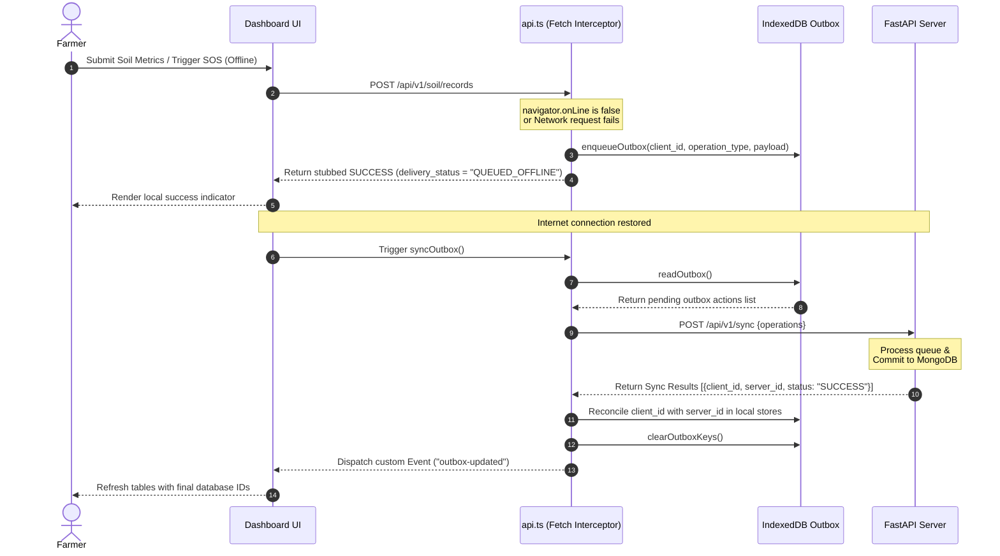

# 📱 HarvestIQ Next.js Frontend Dashboard

### Progressive Web App (PWA) with Offline-First Resiliency

This is the client dashboard for HarvestIQ, built using **Next.js 15**, **React 19**, **TypeScript**, and **Tailwind CSS**. It incorporates service workers for offline asset shell caching and utilizes **IndexedDB** for local data persistence and mutation buffering (Outbox queue).

---

## 🛠️ Technology Stack & Core Tools

*   **Framework:** Next.js 15 (App Router, Server-Side Rendering (SSR) fallback and dynamic Client components)
*   **State Management:**
    *   **Zustand:** Managing local settings, authentication sessions ([authStore.ts](file:///Users/vishaljaiswal/Desktop/HARVESTIQ%20FINAL/harvestiq-client/src/stores/authStore.ts)), and localized translations ([localizationStore.ts](file:///Users/vishaljaiswal/Desktop/HARVESTIQ%20FINAL/harvestiq-client/src/stores/localizationStore.ts)).
    *   **React Query (TanStack Query):** Handles remote state synchronization, caching, and background validation.
*   **Database (Browser-Side):** Raw IndexedDB database instance (`harvestiq-pwa`) configured inside [db.ts](file:///Users/vishaljaiswal/Desktop/HARVESTIQ%20FINAL/harvestiq-client/src/lib/db.ts) to store offline copies of API snapshots and enqueued outbox payloads.
*   **Styling & Components:** Tailwind CSS, Radix UI primitives, Lucide React icons.

---

## 🏗️ Folder Structure

```text
harvestiq-client/
├── public/                 # PWA icons, manifest.json, sw.js (Service Worker)
├── scripts/                # Dev environment start script
├── src/
│   ├── app/                # Next.js 15 App Router Pages
│   │   ├── advisory/       # Advisory Chat (Voice capture support, localized responses)
│   │   ├── auth/           # Login & Registration views
│   │   ├── disease/        # Crop Doctor vision disease tag diagnosis
│   │   ├── farm-setup/     # Farm DB setup wizard
│   │   ├── onboarding/     # Onboarding form for crop types, district & state
│   │   ├── operations/     # Operations dashboard (expenses, harvests, and plots list)
│   │   ├── simulator/      # Scenario modeling widget
│   │   ├── globals.css     # Global styles & premium styling system
│   │   └── page.tsx        # Dashboard Main View (widgets, health-score, yield-risk)
│   ├── components/         # Dashboard & Layout Components
│   │   ├── ui/             # Radix button, input, select primitives
│   │   ├── charts/         # SVG custom ring gauges (HealthScoreRing, RiskGauge)
│   │   ├── dashboard/      # Profitability tables & Crop charts
│   │   ├── layout/         # Navigation & Shell (AppShell.tsx, Sidebar)
│   │   ├── OfflineBanner.tsx# Connectivity drop notification bar
│   │   ├── PwaStatusBar.tsx# Footer showing IndexedDB sizes & outbox sync counts
│   │   └── SosButton.tsx   # Integrated Emergency SOS modal (checklists, Twilio SMS)
│   ├── hooks/              # SWR react-query wrapper hooks (useHealthCard, useWeather)
│   ├── lib/
│   │   ├── api.ts          # Central HTTP client (apiRequest, offline caches, outbox triggers)
│   │   ├── auth.ts         # In-memory JWT tokens manager
│   │   ├── db.ts           # IndexedDB client manager (harvestiq-pwa database schemas)
│   │   └── utils.ts        # Tailwind merge & helper classes
│   └── stores/             # Client Zustand global caches
└── README.md               # This Documentation
```

---

## ⚡ Offline First Dashboard Lifecycle

HarvestIQ's offline capability is built around three pillars:

### 1. The PWA shell Cache
Assets, routes, stylesheet styles, icons, and layout structures are pre-compiled and cached locally by the Service Worker (`sw.js`). When network access drops, the page reloads instantly via the shell.

### 2. Cache-Fallback Interceptor (`apiRequest`)
*   **Location:** [api.ts](file:///Users/vishaljaiswal/Desktop/HARVESTIQ%20FINAL/harvestiq-client/src/lib/api.ts#L787-L830)
*   **GET Interception:** Every query execution first attempts a live fetch. If the request encounters a network failure, server 5xx error, or a JWT 401 refresh rejection (simulating offline page reload where in-memory tokens are lost), the `apiRequest` method catches the error and reads the corresponding snapshot from IndexedDB using `readCachedSnapshot()`.
*   **Demo Fixtures:** If no local IndexedDB snapshot exists, the pipeline resolves static fallback structures (`resolveDemoFixture()`) to ensure no dashboard card crashes or renders blank.

### 3. Mutating Outbox & Sync Queue
When performing POST/PUT/DELETE operations offline, HarvestIQ intercepts them in `apiRequest` and enqueues them in IndexedDB:



---

## 🌐 Bilingual Translation Engine

To serve farmers in their native dialect, HarvestIQ provides bilingual rendering (English and Hindi) across all views.
*   **Translation Handler:** [localizationStore.ts](file:///Users/vishaljaiswal/Desktop/HARVESTIQ%20FINAL/harvestiq-client/src/stores/localizationStore.ts) manages translation packages.
*   **Integration:**
    *   Dashboard labels and form placeholders are translated client-side.
    *   Synthesized briefings, AI crop doctor advisories, and stress index calculations are translated server-side to align with the core deterministic indexes.
